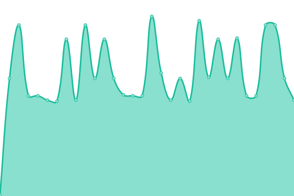

# [📈 Live Status](https://status.morlana.net): <!--live status--> **🟧 Partial outage**

This repository contains the open-source uptime monitor and status page for [Florian Weber](http://webish.one), powered by [Upptime](https://github.com/upptime/upptime).

With [Upptime](https://upptime.js.org), you can get your own unlimited and free uptime monitor and status page, powered entirely by a GitHub repository. We use [Issues](https://github.com/flweber/morlana-uptime/issues) as incident reports, [Actions](https://github.com/flweber/morlana-uptime/actions) as uptime monitors, and [Pages](https://status.morlana.net) for the status page.

<!--start: status pages-->
<!-- This summary is generated by Upptime (https://github.com/upptime/upptime) -->
<!-- Do not edit this manually, your changes will be overwritten -->
<!-- prettier-ignore -->
| URL | Status | History | Response Time | Uptime |
| --- | ------ | ------- | ------------- | ------ |
|  [Morlana Linktree](https://tree.morlana.link) | 🟩 Up | [morlana-linktree.yml](https://github.com/flweber/morlana-uptime/commits/HEAD/history/morlana-linktree.yml) | 

 1086ms
     
 | 

<a href="https://status.morlana.net/history/morlana-linktree">100.00%</a>
    

|  [Morlana DNS 1](152.53.17.185) | 🟩 Up | [morlana-dns-1.yml](https://github.com/flweber/morlana-uptime/commits/HEAD/history/morlana-dns-1.yml) | 

 120ms
     
 | 

<a href="https://status.morlana.net/history/morlana-dns-1">100.00%</a>
    

|  [Morlana DNS 2](45.83.247.102) | 🟥 Down | [morlana-dns-2.yml](https://github.com/flweber/morlana-uptime/commits/HEAD/history/morlana-dns-2.yml) | 

 113ms
     
 | 

<a href="https://status.morlana.net/history/morlana-dns-2">95.71%</a>
    

|  [Morlana DoT 1](dns1.morlana.net) | 🟥 Down | [morlana-do-t-1.yml](https://github.com/flweber/morlana-uptime/commits/HEAD/history/morlana-do-t-1.yml) | 

 124ms
     
 | 

<a href="https://status.morlana.net/history/morlana-do-t-1">95.71%</a>
    

|  [Morlana DoT 2](dns2.morlana.net) | 🟥 Down | [morlana-do-t-2.yml](https://github.com/flweber/morlana-uptime/commits/HEAD/history/morlana-do-t-2.yml) | 

 113ms
     
 | 

<a href="https://status.morlana.net/history/morlana-do-t-2">95.71%</a>
    

|  [Morlana DoH 1](https://dns1.morlana.net/dns-query) | 🟩 Up | [morlana-do-h-1.yml](https://github.com/flweber/morlana-uptime/commits/HEAD/history/morlana-do-h-1.yml) | 

 393ms
     
 | 

<a href="https://status.morlana.net/history/morlana-do-h-1">100.00%</a>
    

|  [Morlana DoH 2](https://dns2.morlana.net/dns-query) | 🟩 Up | [morlana-do-h-2.yml](https://github.com/flweber/morlana-uptime/commits/HEAD/history/morlana-do-h-2.yml) | 

 410ms
     
 | 

<a href="https://status.morlana.net/history/morlana-do-h-2">100.00%</a>
    

|  [Phantom Bot](https://phantom.thephoenixdi.vision) | 🟩 Up | [phantom-bot.yml](https://github.com/flweber/morlana-uptime/commits/HEAD/history/phantom-bot.yml) | 

 562ms
     
 | 

<a href="https://status.morlana.net/history/phantom-bot">100.00%</a>
    

|  [Morlana DNS 1 v6](2a0a:4cc0:1:1221:349e:80ff:fe15:55e8) | 🟥 Down | [morlana-dns-1-v6.yml](https://github.com/flweber/morlana-uptime/commits/HEAD/history/morlana-dns-1-v6.yml) | 

 0ms
     
 | 

<a href="https://status.morlana.net/history/morlana-dns-1-v6">0.00%</a>
    

|  [Morlana DNS 2](2a0f:580:7:1e::6) | 🟥 Down | [morlana-dns-2.yml](https://github.com/flweber/morlana-uptime/commits/HEAD/history/morlana-dns-2.yml) | 

 113ms
     
 | 

<a href="https://status.morlana.net/history/morlana-dns-2">95.69%</a>
    

|  [Morlana DoT 1](dns1.morlana.net) | 🟥 Down | [morlana-do-t-1.yml](https://github.com/flweber/morlana-uptime/commits/HEAD/history/morlana-do-t-1.yml) | 

 124ms
     
 | 

<a href="https://status.morlana.net/history/morlana-do-t-1">95.69%</a>
    

|  [Morlana DoT 2](dns2.morlana.net) | 🟥 Down | [morlana-do-t-2.yml](https://github.com/flweber/morlana-uptime/commits/HEAD/history/morlana-do-t-2.yml) | 

 113ms
     
 | 

<a href="https://status.morlana.net/history/morlana-do-t-2">95.69%</a>
    

<!--end: status pages-->

[**Visit our status website →**](https://status.morlana.net)

## 📄 License

- Powered by: [Upptime](https://github.com/upptime/upptime)
- Code: [MIT](./LICENSE) © [Anand Chowdhary](https://anandchowdhary.com), supported by [Pabio](https://pabio.com)
- Data in the `./history` directory: [Open Database License](https://opendatacommons.org/licenses/odbl/1-0/)
